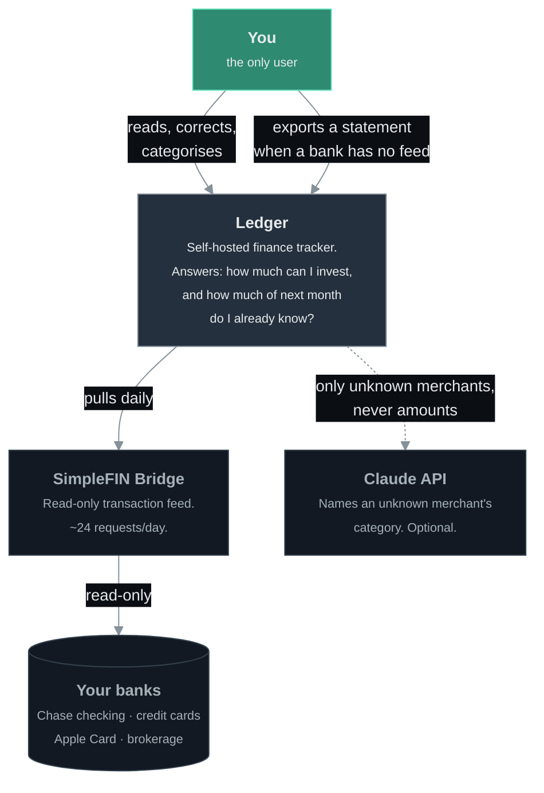

# Architecture

Four diagrams, each answering one question. Start at the top and go down only as
far as you need — the first one fits on a phone screen, the last one names files.

| | Question it answers | Read it when |
|---|---|---|
| **Level 1** (below) | What is this and what does it talk to? | You are new here |
| [Level 2 — Containers](./containers.md) | What are the moving parts? | You are setting it up or debugging a whole subsystem |
| [Level 3 — Components](./components.md) | Which module does what? | You are about to change code |
| [Data flow](./data-flow.md) | How does one transaction travel? | You are chasing a wrong number |

They follow the [C4 model](https://c4model.com/)'s idea of hierarchical zoom
levels, but use plain Mermaid flowcharts rather than Mermaid's `C4Context`
syntax, which is [documented as
experimental](https://mermaid.js.org/syntax/c4.html) and needs per-element pixel
offsets to lay out. Plain flowcharts render natively on GitHub with no build
step and no toolchain, which is what keeps these diagrams cheap enough to
actually update.

`tests/architecture.test.ts` asserts that every file path, database table, and
npm script named in these documents still exists. Rename a module and the test
tells you which diagram went stale.

---

## Level 1 — System context

One person, their banks, and two outside services.

### What crosses each boundary

| Boundary | What moves | What never moves |
|---|---|---|
| Bridge → Ledger | Dates, amounts, descriptions, balances | Bank credentials — the bridge holds those, this app never sees them |
| Ledger → Claude | Merchant **names** only, batched | Amounts, dates, balances, account numbers |
| Ledger → anywhere else | Nothing | There is no other outbound call |

The Claude step is optional. Without `ANTHROPIC_API_KEY` the categoriser skips
it and leaves unknown merchants in `Uncategorized`, which costs accuracy and
nothing else.

### Two things this deliberately is not

**Not multi-user.** No authentication, no tenancy, no row-level security. It
runs on localhost or behind Tailscale. Adding a second user would mean revisiting
every query in `src/lib/queries.ts`.

**Not a source of truth for money.** The bank is. This app reconciles against
`accounts.balance_cents` and shows the drift rather than hiding it, because a
ledger that silently disagrees with your bank is worse than no ledger.

---

Next: [Level 2 — Containers](./containers.md)
