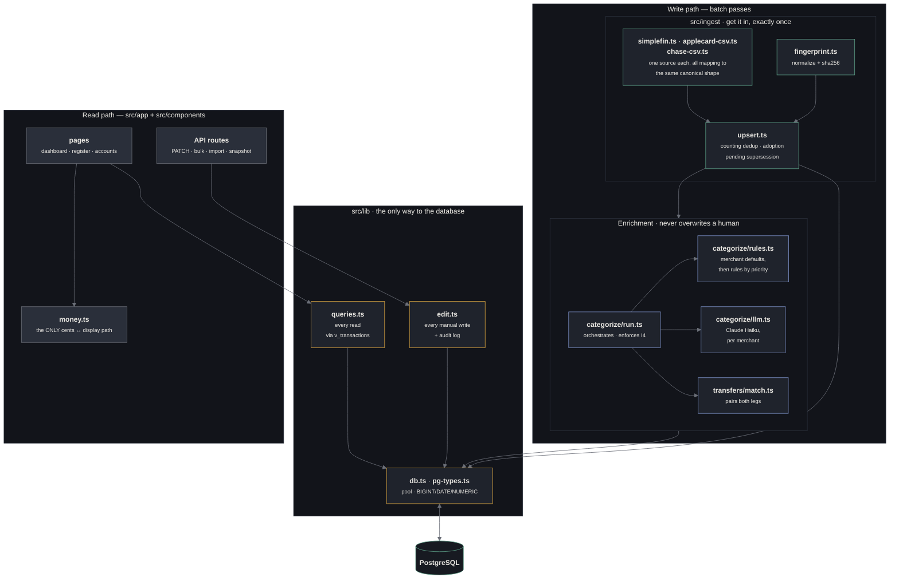

# Level 3 — Components

Which module does what, and which ones you must not bypass.

← [Level 2](./containers.md) · [Level 1](./README.md) · → [Data flow](./data-flow.md)

## The four modules that carry the invariants

Most files here are ordinary. These four are not — each is the single place a
rule is enforced, and bypassing one breaks something silently.

### `src/money.ts` — the only cents↔display path

Money is integer cents everywhere (**I1**). `parseCents` scales through string
manipulation rather than multiplying a float, so `0.29` never becomes
`28.999999`. Formatting happens at the render boundary and nowhere else.

*Bypassing it:* a `parseFloat` on a currency string, anywhere, reintroduces
rounding error into a ledger whose whole value is being exactly right.

### `src/ingest/fingerprint.ts` — `normalize()` is load-bearing

`fingerprint = sha256(account | date | amount | normalize(description))` is what
makes re-imports safe (**I7**) and lets a CSV row and a synced row resolve to one
transaction (**I8**).

*Changing `normalize()` invalidates every stored fingerprint.* The next import
would double-count. If you change it, re-fingerprint the whole table in the same
migration.

Two subtleties it already handles: store numbers and refs are stripped *before*
punctuation, because the markers (`#`, `REF:`) are punctuation; and bank CSVs pad
descriptions to align columns, so `VENMO␣␣␣␣CASHOUT` and `VENMO CASHOUT` must
collapse identically.

### `src/categorize/run.ts` — enforces I4

Every machine pass carries `AND NOT category_locked`. `runCategorization`
re-counts locked rows afterwards and **throws** if the count fell, so a dropped
guard fails loudly rather than quietly eating a decision you made.

*Bypassing it:* a batch `UPDATE transactions SET category_id` without that guard
silently overwrites human decisions, and nothing reports it.

### `src/lib/edit.ts` — the manual edit contract

Every user edit goes through here. It writes one `transaction_edits` row per
changed field (**I6**), sets `category_source = 'manual'` so the database trigger
sets the lock (never set the flag directly), and returns the refreshed row from
`v_transactions` so the client reconciles against resolved `eff_*` values
(**I3**).

## Read through the view, always

`v_transactions` resolves the override layer: `eff_amount_cents`,
`eff_posted_date`, `eff_description`, `eff_cost_type`, `eff_necessity`, and the
single `counts_as_spending` predicate.

Raw `transactions.amount_cents` is what the bank said and is never mutated
(**I2**) — that immutability is what makes reconciliation possible. Only two
places may read it: the reconciliation check, and fingerprinting.

*Bypassing it:* resolving `COALESCE(amount_cents_override, amount_cents)` in
TypeScript works until a second call site does it differently, and then two
screens disagree about the same transaction.

## Three driver-level traps, already handled

`src/lib/pg-types.ts` exists because Postgres types do not map cleanly to JS:

| Type | Default | Why that breaks |
|---|---|---|
| `BIGINT` | string | `"1050" + 1` is `"10501"` |
| `NUMERIC` | string | every `SUM` in the views is numeric — same bug, on totals |
| `DATE` | JS `Date` | parsed as **UTC midnight**, so `2026-09-01` reads as Aug 31 west of Greenwich |

The `DATE` one shipped and was only caught when a month label read one day
early. Dates stay ISO strings end to end.

---

Next: [Data flow](./data-flow.md) — how one transaction travels.
