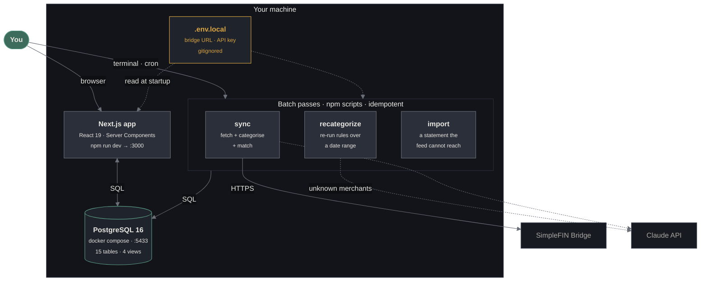

# Level 2 — Containers

The separately runnable pieces, and where state lives.

← [Level 1](./README.md) · → [Level 3](./components.md) · [Data flow](./data-flow.md)



## The parts

| Container | Runs | Holds state? |
|---|---|---|
| **Next.js app** | `npm run dev`, or `build` + `start` | No — reads and writes Postgres |
| **Batch passes** | `npm run sync` · `recategorize` · `import` · `transfers` | No |
| **PostgreSQL** | `docker compose up -d` | **Yes. Everything.** |
| **`.env.local`** | — | Credentials only. Never committed. |

Postgres is the only durable state. Losing the app is an inconvenience; losing
the database is losing your ledger, because the 90-day bridge window cannot
rebuild history older than that.

## Why the passes are separate from the app

Ingest, categorisation, and transfer matching are three **independent idempotent
passes**, not steps in one function. Each can re-run over any date range without
corrupting state. That separation is what makes the development loop possible:
edit a rule, re-run the categoriser over two years, see what changed. Fusing
them would mean re-fetching from the bridge to re-categorise — and the bridge
allows ~24 requests a day before it disables the token.

Idempotency is not incidental. It is enforced by tests:

- re-importing a statement three times leaves the row count unchanged
- a second sync over the same window inserts nothing
- re-running the categoriser never touches a row a human has locked

## Scheduling

There is no in-process scheduler. `sync` is a plain script so it stays runnable
by hand:

```cron
0 6 * * * cd /path/to/ledger && npm run sync >> sync.log 2>&1
```

Exit codes: `0` ok · `1` failed · `2` partial, one institution broken while
others synced · `3` misconfigured. The distinction matters under cron, where the
exit code is the only thing anyone reads.

## The one configuration trap

`SIMPLEFIN_ACCESS_URL` is a bearer credential **in URL form**: the username and
password are embedded in the URL itself, before the host. Two consequences the
code has to respect:

1. Node's `fetch` refuses a URL carrying credentials, so they are moved to an
   `Authorization` header before the request (`src/ingest/simplefin.ts`).
2. It must never reach a log. `redactUrl()` is the only form allowed near one,
   and a test asserts no error in the sync path interpolates it.

---

Next: [Level 3 — Components](./components.md)
