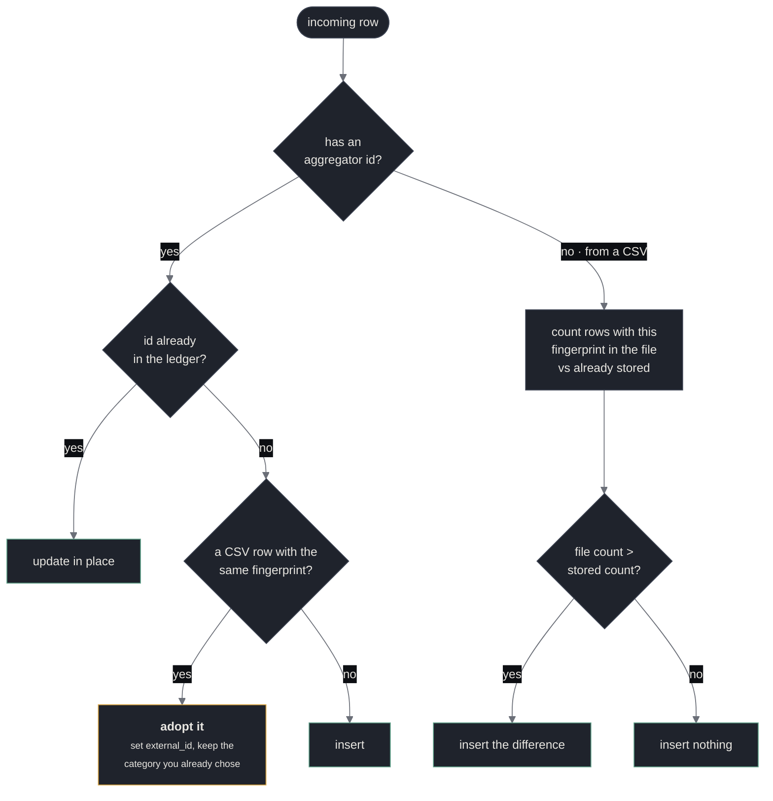

# Data flow

How one transaction travels from your bank to a number on the dashboard, and
where to look when that number is wrong.

← [Level 3](./components.md) · [Level 2](./containers.md) · [Level 1](./README.md)

```mermaid
%%{init: {'theme':'base','themeVariables':{
  'background':'transparent',
  'primaryColor':'#1f232c','primaryTextColor':'#e8e6e1','primaryBorderColor':'#3a4150',
  'lineColor':'#6b6f78','secondaryColor':'#171a21','tertiaryColor':'#12141a',
  'clusterBkg':'#12141a','clusterBorder':'#2a2f3a',
  'edgeLabelBackground':'#0d0f13','fontSize':'14px'
}}}%%
flowchart LR
    bank["Bank"]

    subgraph in["Ingest"]
        direction TB
        fetch["fetch<br/><span style='font-size:11px'>bridge or CSV</span>"]
        fp["fingerprint"]
        dedup{"seen<br/>before?"}
        insert["insert"]
        skip["count as<br/>duplicate"]
    end

    subgraph enrich["Enrich · skips locked rows"]
        direction TB
        merchant["merchant<br/>default"]
        rule["rule"]
        model["Claude"]
        uncat["Uncategorized"]
        pair["transfer<br/>matcher"]
    end

    subgraph read["Read"]
        direction TB
        view["v_transactions<br/><span style='font-size:11px'>resolves eff_* and<br/>counts_as_spending</span>"]
        totals["v_monthly_cashflow"]
        screen["dashboard"]
    end

    human["<b>you</b><br/><span style='font-size:11px'>correct it</span>"]

    bank --> fetch --> fp --> dedup
    dedup -->|no| insert
    dedup -->|yes| skip
    insert --> merchant --> rule --> model --> uncat
    uncat --> pair --> view --> totals --> screen
    screen -.->|"PATCH"| human
    human -.->|"locks the row"| view

    classDef ing fill:#1f232c,stroke:#5b9c85,color:#e8e6e1
    classDef enr fill:#1f232c,stroke:#7b8fc4,color:#e8e6e1
    classDef rd fill:#1f232c,stroke:#d9a441,color:#e8e6e1
    classDef ext fill:#171a21,stroke:#3a4150,color:#a8a69f
    classDef hum fill:#3d6b5c,stroke:#5b9c85,color:#e8e6e1
    class fetch,fp,insert,skip ing
    class merchant,rule,model,uncat,pair enr
    class view,totals,screen rd
    class bank ext
    class human hum
```



## Deduplication, in detail

The step that makes re-importing safe. It counts rather than checking existence,
because two identical $4.50 coffees on the same day are **not** duplicates.



**Adoption** is the subtle half. You import a statement by hand and categorise a
row. Weeks later the API's sync window covers that same date. Without adoption
you would get two transactions for one real purchase; with it, the synced row
claims the hand-imported one and keeps the categorisation. Verified against real
data: a 343-row Chase statement imported over an already-synced range inserted
295 and recognised exactly 48 as already present.

## When a number looks wrong

Work down this list. Each step rules out a whole class of cause.

**1. Does the ledger agree with the bank?**

The dashboard shows a reconciliation banner when it does not. Non-zero drift
means the ledger is missing or double-counting transactions, and nothing
downstream is trustworthy until it is explained. A real example: drift of exactly
$54.51 turned out to be one Apple Card purchase that fell outside the 89-day
window.

**2. Is it categorised the way you think?**

```sql
SELECT eff_description, eff_amount_cents, category_name,
       eff_necessity, eff_cost_type, counts_as_spending
FROM v_transactions WHERE id = '…';
```

`counts_as_spending = false` is the usual answer. It is false when the row is a
transfer leg, voided, superseded, excluded, still pending, or categorised as
income/transfer/investment.

**3. Is it hiding in a transfer?**

Transfer legs are excluded from spending by design. A miscategorised transfer
therefore **removes** money from your totals rather than misfiling it — which is
why a rule like `/AUTOPAY/` is dangerous: it catches `CITY UTILITIES AUTOPAY` and
that bill disappears. Name the card in transfer rules.

**4. Is the axis wrong rather than the category?**

`cost_type` and `necessity` are independent. A row can be in the right category
with the wrong axis, which moves it between "required" and "discretionary"
without changing its name on screen.

## Two axes, not one

`cost_type` asks *is this predictable?* `necessity` asks *can I cut it?*

| | required | discretionary |
|---|---|---|
| **fixed** | rent, insurance | Netflix, gym |
| **variable** | groceries, gas | restaurants, travel |

Your investable number comes off the necessity axis (`income − required`). Your
forecasting confidence comes off the cost axis — fixed costs are the part of next
month you already know. One toggle would lose one of those questions.

## Investment accounts are on a different axis again

A contribution is a transaction on checking with `necessity = 'investment'`.
Account **value** lives in `balance_snapshots` and never reaches
`v_monthly_cashflow` — a 6% month is not a paycheck.

Return is Modified Dietz, which weights each contribution by the fraction of the
period it was invested. On a real account this reported 3.44% where a naive
`(end − start) / start` reported 18.59% by counting deposits as investment gains.

The identity `opening + contributed + gain = current` is asserted in a test. If
it drifts, a contribution lost its `destination_account_id`.
